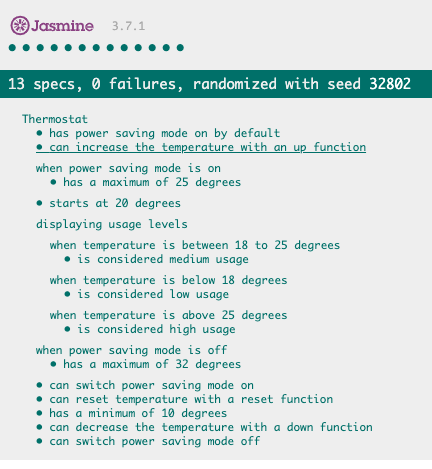

# Thermostat

## Introduction

This is a simple thermostat app built entirely in Javaascript. The purpose of the project was to practice writing Javascript code, interact with the DOM, use AJAX and do some simple CSS styling. The program was built entirely through TDD with Jasmine as the test framework.

## How to use

#### To set up the project

Clone this repo to your computer and then open "index.html" in your web browser.

#### Testing

Testing was completed in Jasmine and all tests are passing. To view the tests, open the file "SpecRunner.html" in your web browser. A screenshot is included below.

## Program requirements

* Thermostat starts at 20 degrees
* You can increase the temperature with an up function
* You can decrease the temperature with a down function
* The minimum temperature is 10 degrees
* If power saving mode is on, the maximum temperature is 25 degrees
* If power saving mode is off, the maximum temperature is 32 degrees
* Power saving mode is on by default but it can also be turned off
* You can reset the temperature to 20 with a reset function
* You can ask about the thermostat's current energy usage: < 18 is `low-usage`, <= 25 is `medium-usage`, anything else is `high-usage`.